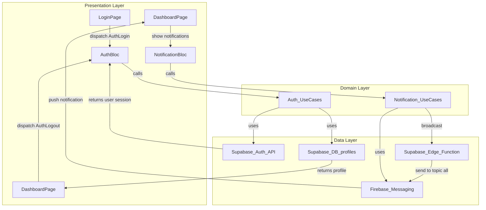

# 📱 Flutter Supabase App (Clean Architecture + BLoC + Firebase)

A Flutter app with:

- **Supabase** for Authentication & Database  
- **Firebase (FCM)** for Push Notifications  
- **BLoC** for State Management  
- **Clean Architecture** for scalability and testability  

---

## 🚀 Features
- ✅ Authentication (Supabase email & password)  
- ✅ Dashboard with user profile (from Supabase `profiles` table)  
- ✅ Push Notifications (Firebase Cloud Messaging)  
- ✅ Global Notifications (notify all users via Edge Function)  
- ✅ Clean Architecture with feature-based structure  
- ✅ Logout functionality  

---

## 🏗️ Project Architecture

This project follows **Clean Architecture** + **BLoC pattern** with feature-based folders.

```text
lib/
├── core/                      # Common utilities, themes, errors
├── firebase_options.dart      # Generated by FlutterFire CLI
├── app.dart                   # Root widget with routing & blocs
├── main.dart                  # App entry point
├── features/
│   ├── auth/                  # Authentication feature
│   │   ├── data/              # Data layer (models, repositories)
│   │   ├── domain/            # Domain layer (entities, use cases)
│   │   └── presentation/      # Presentation layer (bloc, ui)
│   ├── dashboard/             # Dashboard feature
│   │   ├── data/
│   │   ├── domain/
│   │   └── presentation/
│   └── notifications/         # Notifications feature
│       ├── data/
│       ├── domain/
│       └── presentation/
```

---

### 🔑 Clean Architecture Layers
- **Data Layer** → Handles Supabase & Firebase APIs  
- **Domain Layer** → Business logic (entities + use cases)  
- **Presentation Layer** → UI + BLoC state management  

---

### 📊 Architecture Flow



---

### 🛠️ Setup & Installation

#### 1. Clone Repository
```bash
git clone https://github.com/yourusername/flutter_supabase_bloc_app.git
cd flutter_supabase_bloc_app
```

#### 2. Install Dependencies
```bash
flutter pub get
```

#### 3. Configure Supabase
* Create a project at supabase.io
* Get your API URL & anon key
* Add them in your auth_repository.dart or environment config.
* Create a profiles table with:
```sql
id uuid references auth.users not null primary key,
username text,
fcm_token text,
created_at timestamp default now()
```

#### 4. Configure Firebase
* Install FlutterFire CLI:
```bash
dart pub global activate flutterfire_cli
```
* Run: 
```bash
flutterfire configure
```
* This generates lib/firebase_options.dart with DefaultFirebaseOptions.

#### 5. Setup Firebase Cloud Messaging
* Enable FCM in Firebase console
* Add google-services.json (Android) and GoogleService-Info.plist (iOS)

#### 6. Supabase Edge Function for Push Notifications
###### Deploy a function (send-push) that uses Firebase Admin SDK to send messages:
```ts
// index.ts (Edge Function)
import { serve } from "https://deno.land/std/http/server.ts";
import { initializeApp, applicationDefault } from "https://esm.sh/firebase-admin/app";
import { getMessaging } from "https://esm.sh/firebase-admin/messaging";

const app = initializeApp({ credential: applicationDefault() });
const messaging = getMessaging(app);

serve(async (req) => {
  const { title, body } = await req.json();
  const message = { topic: "all", notification: { title, body } };
  await messaging.send(message);
  return new Response(JSON.stringify({ success: true }), { status: 200 });
});
```
###### Deploy:
```bash
supabase functions deploy send-push --no-verify-jwt
```

---
#### ▶️ Running the App
```bash
flutter run
```
---

#### 📌 Usage Flow
1. Login with Supabase credentials.
2. Dashboard loads user profile.
3. User is automatically subscribed to FCM topic "all".
4. Supabase Edge Function can send broadcast notifications.
5. Logout returns to login page.

---

#### 📂 Example Key Files
* main.dart → initializes Firebase & Supabase
* my_app.dart → root widget with routing & bloc setup
* login_page.dart → login form with AuthBloc
* dashboard_page.dart → user profile + logout
* notification_bloc.dart → FCM token registration + listeners

---

#### 🔮 Next Steps
* Add role-based dashboards (e.g., admin vs user)
* Group/topic-based notifications (admins, team_X, etc.)
* Improve error handling + form validation
* Add unit & widget tests

---

💡 Built with ❤️ using Flutter + Supabase + Firebase + BLoC + Clean Architecture.